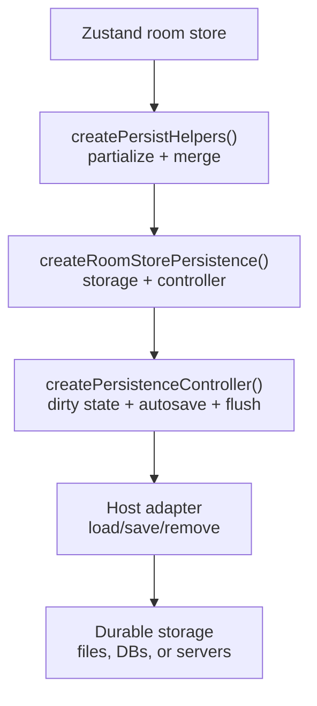
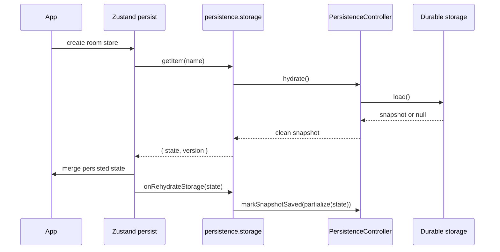
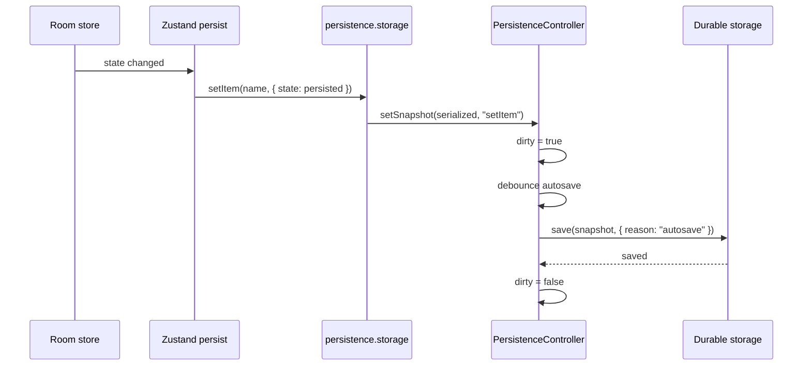

# Persistence

SQLRooms persistence is designed for local-first analytics apps where the host
application owns durable storage. The storage might be a DuckDB table, a project
file, IndexedDB, a server endpoint, or another workspace-specific location.

The persistence API separates three concerns:

* What part of room state is durable.
* How durable snapshots are loaded, saved, and removed.
* When a changed snapshot should be treated as dirty and flushed.

SQLRooms room state is built from composable slices on top of a
[Zustand room store](/state-management#why-zustand). Persistence uses the same
store and slice model: slice configs define the durable shape, and the
persistence helpers connect that shape to host-owned storage.

Most apps should start with `createRoomStorePersistence()`. It composes the
lower-level controller with
[Zustand persist middleware](https://zustand.docs.pmnd.rs/reference/integrations/persisting-store-data)
storage and room-store subscription glue.

## API Layers



Use the layers this way:

* `createPersistHelpers()` maps slice config schemas to a typed persisted state
  shape and merges persisted configs back into runtime state.
* `createRoomStorePersistence()` is the usual app integration point. It exposes
  `storage` for Zustand persist, save status through `controller`, and flush
  helpers for close or navigation events.
* `createPersistenceController()` is the storage-agnostic save policy. Use it
  directly only when you are not integrating a Zustand room store.

## Recommended Room Store Setup

For a normal SQLRooms app, define the persistable slice configs, create helpers,
then pass the same partialization function to both Zustand persist and the
persistence helper.

```ts
import {
  createPersistHelpers,
  createRoomStore,
  createRoomStorePersistence,
  persistSliceConfigs,
} from '@sqlrooms/room-store';
import {BaseRoomConfig} from '@sqlrooms/room-config';
import {LayoutConfig} from '@sqlrooms/layout-config';

const sliceConfigSchemas = {
  room: BaseRoomConfig,
  layout: LayoutConfig,
} as const;

const persistHelpers = createPersistHelpers(sliceConfigSchemas);

const persistence = createRoomStorePersistence<RoomState>({
  partialize: persistHelpers.partialize,
  autosaveDelayMs: 300,
  load: async () => loadWorkspaceState(),
  save: async (snapshot, metadata) => {
    await saveWorkspaceState(snapshot, metadata?.reason);
  },
});

export const {roomStore, useRoomStore} = createRoomStore<RoomState>(
  persistSliceConfigs<RoomState, typeof sliceConfigSchemas>(
    {
      name: 'workspace-state',
      sliceConfigSchemas,
      storage: persistence.storage,
      partialize: persistence.partialize,
      merge: persistHelpers.merge,
      onRehydrateStorage: persistence.onRehydrateStorage,
    },
    (set, get, store) => ({
      // Compose room slices here.
    }),
  ),
);
```

The important invariant is that `storage` receives the already-partialized
persisted state shape. That is why `createRoomStorePersistence()` returns
`PersistStorage<TPersisted>`, not `PersistStorage<RoomState>`.

## Hydration Flow

When using Zustand persist, hydration has two phases: the durable snapshot is
loaded by SQLRooms persistence, then Zustand merges the persisted state into the
runtime store.



`onRehydrateStorage()` matters because the runtime state after merge might not be
byte-for-byte identical to the loaded snapshot. Defaults, migrations, and schema
normalization can all change the runtime shape. Marking the post-merge state as
saved prevents the app from treating hydration as a user edit.

## Save Flow

Zustand persist calls `storage.setItem()` when its persisted state changes. The
storage adapter does not write immediately. It hands the serialized snapshot to
the controller, which marks it dirty and schedules a save when autosave is
enabled.



Call `persistence.flush('final-flush')` before unload, close, project switch, or
any other operation where pending state must be durable before continuing.

## Direct Store Subscription

Some hosts want persistence to observe the room store directly rather than only
responding to Zustand persist storage calls. Pass `store` when creating
persistence, or call `bindStore()` later.

```ts
const persistence = createRoomStorePersistence<RoomState>({
  store: roomStore,
  partialize: persistHelpers.partialize,
  autosaveDelayMs: 300,
  load,
  save,
});
```

Direct binding is useful when:

* You are not using Zustand persist middleware.
* You need explicit control over initial binding.
* You want `shouldPersistChange` guards for host lifecycle states.

### Initial Binding

By default, an initially-bound store snapshot is treated as already saved:

```ts
createRoomStorePersistence({
  store,
  partialize,
  load,
  save,
  markInitialSnapshotSaved: true,
});
```

Set `markInitialSnapshotSaved: false` when the initial state should be persisted
as a new durable snapshot.

If persistence is created before `store.getState()` returns the completed initial
state, pass `initialState`:

```ts
const persistence = createRoomStorePersistence({
  store,
  initialState,
  partialize,
  load,
  save,
});
```

### Skipping Changes

Use `shouldPersistChange` when a store change should update the last observed
snapshot but should not be saved.

```ts
const persistence = createRoomStorePersistence({
  store,
  partialize,
  load,
  save,
  shouldPersistChange: (state) => state.room.initialized,
});
```

This is useful during startup, teardown, restore flows, or failed initialization
states.

## Snapshot Equivalence

The controller compares snapshots by strict equality by default. This is ideal
for JSON string snapshots. For structured snapshots, provide either
`compareSnapshots` or `getSnapshotRevision`.

```ts
createRoomStorePersistence({
  partialize,
  load,
  save,
  serialize: (state) => ({
    revision: state.revision,
    payload: state,
  }),
  deserialize: (snapshot) => snapshot.payload,
  getSnapshotRevision: (snapshot) => snapshot.revision,
});
```

Use `compareSnapshots` when revision equality is not enough:

```ts
createRoomStorePersistence({
  partialize,
  load,
  save,
  compareSnapshots: (next, previous) =>
    next.contentHash === previous.contentHash &&
    next.layoutHash === previous.layoutHash,
});
```

## Low-Level Controller

Use `createPersistenceController()` directly when you need persistence policy
without Zustand.

```ts
import {createPersistenceController} from '@sqlrooms/room-store';

const controller = createPersistenceController({
  autosaveDelayMs: 300,
  getSnapshot: () => serializeCurrentWorkspace(),
  adapter: {
    load: () => loadWorkspaceSnapshot(),
    save: (snapshot, metadata) =>
      saveWorkspaceSnapshot(snapshot, metadata?.reason),
  },
});

const snapshot = await controller.hydrate();
restoreWorkspace(snapshot);
controller.markSnapshotSaved(serializeCurrentWorkspace());

controller.markDirty('manual');
await controller.flush('final-flush');
```

The controller owns:

* `hydrating`, `dirty`, `saving`, and `pendingSave` state.
* Autosave scheduling.
* Final flush behavior.
* Coalescing in-flight saves so the latest snapshot wins.
* Error reporting through `controller.getState().error` and subscribers.

It does not own:

* Which fields are durable.
* How snapshots are serialized.
* Where snapshots are stored.
* How loaded snapshots are merged into runtime state.

## Remove Flow

Remove flow is for deleting or clearing the durable workspace snapshot, not for
ordinary edits. It is relevant for workflows such as deleting a project, resetting
a saved workspace, clearing local app data, or replacing a workspace with a
freshly imported one.

If you pass `remove`, `persistence.storage.removeItem(name)` first flushes
pending state so the host does not lose an in-flight save. It then pauses dirty
tracking, calls your remove adapter, and marks the saved snapshot as `null`.

```ts
const persistence = createRoomStorePersistence({
  partialize,
  load,
  save,
  remove: async (name) => {
    await deleteWorkspaceState(name);
  },
});
```

Without a `remove` option, `removeItem()` throws. This makes accidental durable
deletes explicit.

## Practical Checklist

When integrating persistence in an app:

1. Decide the durable state shape. Prefer persisted slice configs first.
2. Define Zod schemas for persisted slice configs.
3. Use `createPersistHelpers()` for `partialize` and `merge`.
4. Use `createRoomStorePersistence()` for storage, dirty tracking, autosave, and
   final flush.
5. Pass `persistence.storage`, `persistence.partialize`, and
   `persistence.onRehydrateStorage` to Zustand persist.
6. Register `persistence.flush('final-flush')` for unload, close, or project
   switch.
7. Use `createPersistenceController()` directly only for non-Zustand persistence
   flows.
